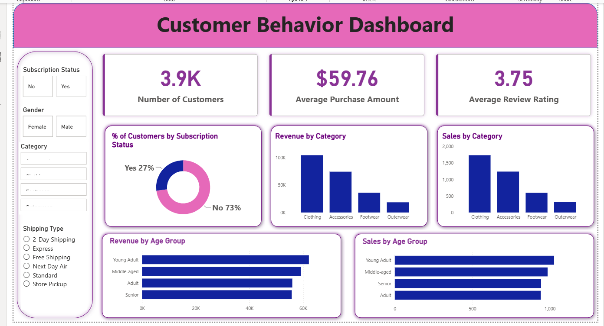

# customer-behavior-analysis-project
End-to-end customer behavior analysis project using SQL, Python, and Power BI to uncover business insights.


## 📌 Project Overview
This project analyzes customer shopping behavior using transactional data from 3,900 purchases across various product categories. The goal is to uncover insights into spending patterns, customer segments, product preferences, and subscription behavior to guide strategic business decisions.

---

## 🎯 Objectives

- Clean and preprocess the dataset
- Analyze customer purchasing behavior
- Solve business questions using SQL
- Create interactive dashboards
- Provide actionable business recommendations

---

## 🧠 Skills Demonstrated

- Data Cleaning & Preprocessing
- Exploratory Data Analysis
- SQL Data Analysis
- CTEs & Window Functions
- Aggregation & Subqueries
- Customer Segmentation
- KPI Development
- Data Visualization
- Power BI Dashboard Development
- Business Insights & Recommendations

---

## 🛠️ Tools & Technologies

- SQL (MySQL)
- Pandas
- NumPy
- Power BI

---

## 💼 Business Problem

The business wants to understand customer purchasing behavior,
identify high-value customer segments, evaluate subscription
performance, and determine factors associated with higher spending.

This analysis uses customer transaction data to identify patterns
that can support marketing, retention, and revenue-growth decisions.

---

## 📂 Dataset

**Description:**
- Rows: 3,900
- Columns: 18
- Source: kaggle
- Key Features:
- Customer demographics (Age, Gender, Location, Subscription Status)
- Purchase details (Item Purchased, Category, Purchase Amount, Season, Size, Color)
- Shopping behavior (Discount Applied, Promo Code Used, Previous Purchases, Frequency of Purchases, Review Rating, Shipping Type)
- Missing Data: 37 values in Review Rating column

---

## 📌 Key KPIs

- Total Revenue
- Average Purchase Amount
- Total Customers
- Average Review Rating
- Subscriber vs Non-Subscriber Revenue
- Discount Usage Rate
- Revenue by Age Group
- Revenue by Gender

---

## 📊 Project Workflow

1. Data Collection
2. Data Cleaning
3. Exploratory Data Analysis (EDA)
4. SQL Business Analysis
5. Data Visualization
6. Dashboard Creation
7. Business Insights

---

## ❓ Business Questions Solved

1. what is the total revenue generated by male vs female customers
2. which customer use discount but still spend more than avg purchse amount
3. which are the top 5 products with the highest avg review rating
4. compare the avg purchase amounts between standard vs express shipping
5. do subscribed customers spent more? compare avg spend and total revenue between subscribers and non-subscribers
6. Which 5 products have the highest percentage of purchases when discount applied?
7. segment customers into new, loyal, returning based on their previous purchases and show the count of each segment
8. what are the top 3 most purchases products within each category
9. are customers who are repeated buyers ( more than 5 previous purchases ) also likely to subscribe ?
10. what are the revenue contribution of each age group

---

## 📈 Key Insights

- Female customers generate slightly higher total revenue than male customers
- Discounts successfully attract high-value shoppers
- subscription customers are the most valueable segment
- express shipping customers spend significantly more
- customer retention is the biggest growth opportunity

---

## 💡 Business Recommendations

- Increase subscription adoptaion through exclusive benefits, discounts and loyalty rewards.
- Offer free or discounted express shipping for high-value customers to further increase average order value.
- Launch gender specific promotions and product recommendations to maximize revenue.
- Use targeted discounts instead of blanket promotions to maximize both salse value and profitability.
- Converting New customers into Returning and Returning into Loyal customers offers the greatest opportunity for sustainable revenue growth.

---

## 📷 Dashboard Preview



---

## 📁 Project Structure
```text
customer-behavior-analysis/
│
├── dataset/
│   └── customer_shopping_behavior.csv
│
├── notebooks/
│   └── customer_cleaned.ipynb
│
├── sql/
│   └── customer_analysis.sql
│
├── powerbi/
│   └── customer_behavior_dashboard.pbix
│
├── images/
│   └── dashboard.png
│
└── README.md
```
---


## ▶️ How to Run

### 1. Python Analysis
Open the notebook:

`notebooks/customer_cleaned.ipynb`

Run the cells to reproduce the data cleaning and analysis.

### 2. SQL Analysis
Open:

`sql/customer_analysis.sql`

Run the queries in MySQL to reproduce the business analysis.

### 3. Power BI Dashboard
Open:

`powerBi/customer_behavior_dashboard.pbix`

Open the file in Power BI Desktop to explore the interactive dashboard.

---

## 👨‍💻 Author

**Yogesh Waghmare**

GitHub: https://github.com/yogesh-waghmare

LinkedIn: (https://www.linkedin.com/in/yogesh-waghmare13/)
